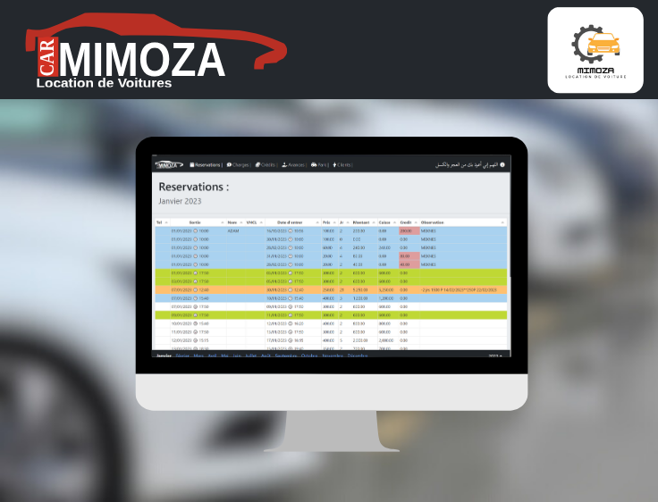
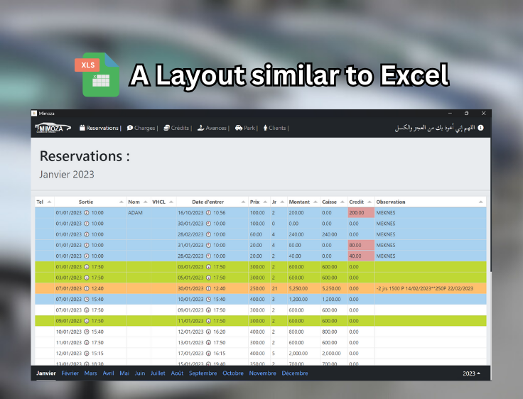
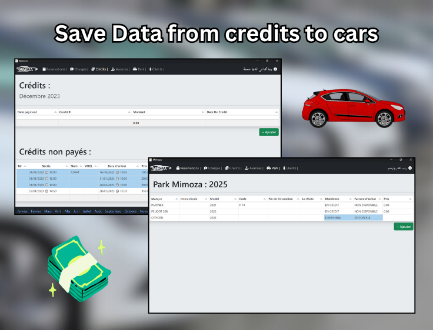
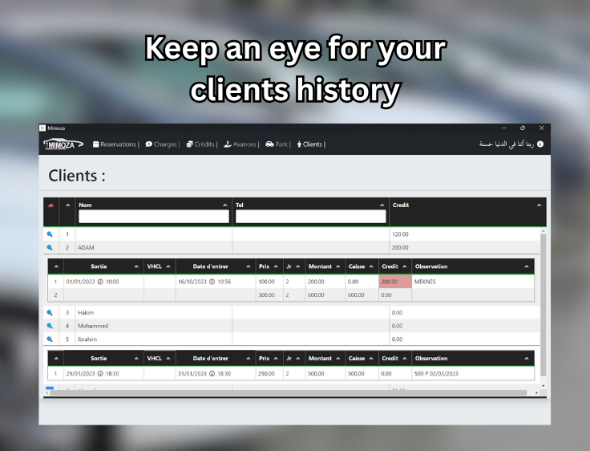

<h1 align="center" style="font-size: 2.2rem; margin-bottom: 0;">🚗 Car Rental Management System</h1>

  A desktop application built for <strong>Mimoza</strong>, a car rental agency based in <em>Meknes</em>.

  

<h2>🚀 Overview</h2>

  The <strong>Car Rental Management System</strong> is a modern desktop solution designed to replace Mimoza’s traditional Excel-based workflow.
  It centralizes rental operations, client management, payments, and overall agency finances into one intuitive system.

  Developed with <strong>Electron</strong> and <strong>SQLite</strong>, the application runs locally on Windows 10 systems, providing a fast and reliable experience without requiring an internet connection.

<h3>🧭 My Role</h3>

  As the <strong>lead developer</strong> of a three-person team, I was responsible for:

<ul>
  <li>📋 Coordinating team tasks and project milestones.</li>
  <li>🏗️ Architecting the code structure and component design.</li>
  <li>⚙️ Implementing key features and UI logic.</li>
  <li>💻 Deploying and configuring the application on the agency’s Windows 10 systems.</li>
</ul>

<h2>✨ Key Features</h2>

<ul>
  <li>🚘 Manage vehicle inventory, rental contracts, and client data.</li>
  <li>💳 Track payments and generate financial summaries.</li>
  <li>📅 Monitor rental timelines and availability in real time.</li>
  <li>📊 Export and print administrative reports.</li>
  <li>🖥️ Desktop-first experience built with Electron.</li>
</ul>

<h2>🧩 Tech Stack</h2>

<table style="width:100%; text-align:left;">
  <tr>
    <th style="padding:6px;">Technology</th>
    <th style="padding:6px;">Purpose</th>
  </tr>
  <tr><td>⚡ Electron</td><td>Desktop app framework for cross-platform builds</td></tr>
  <tr><td>💾 SQLite</td><td>Lightweight local database for storing all data offline</td></tr>
  <tr><td>🎨 Bootstrap</td><td>Frontend design and responsive UI components</td></tr>
  <tr><td>🟨 JavaScript</td><td>Core application logic and data handling</td></tr>
</table>

<h2>🖥️ Hosting & Deployment</h2>

<ul>
  <li>🪟 <strong>Windows 10</strong> installation for offline operation at the Mimoza agency.</li>
  <li>📦 Packaged as a standalone executable using <strong>Electron Builder</strong>.</li>
</ul>

<h2>🖼️ Screenshots</h2>

  
  &nbsp;
  
  &nbsp;
  
    &nbsp;
  

## 👥 Contributors

| Name | Role | GitHub |
|------|------|--------|
| **Adam Kourchi** | Lead Developer | [@adamkourchi](https://github.com/adamkourchi) |
| **Aarafat el hajjaji** | Developer | [@aarafat](https://github.com/aarafat-dev) |
| **Bilal hajjaji** | Developer | [@bilal](https://github.com/lilbilal1) |

---
